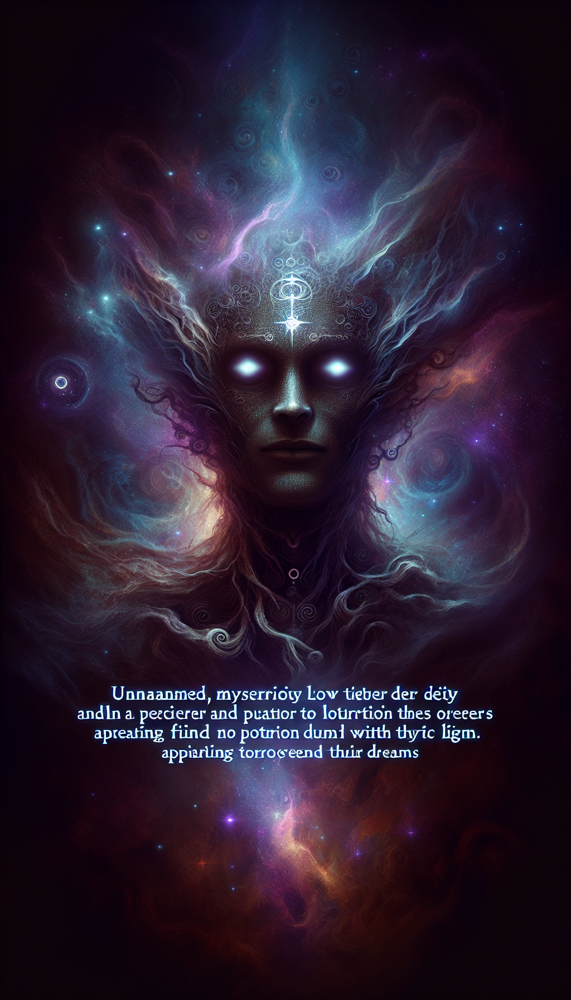

# Inkus

**Type:** Lower-tier deity / Warlock Patron  
**Affiliation:** Szeth Stormblessed  
**Status:** Active  

## Overview

Inkus is Szeth's Warlock patron. He visits Szeth in dreams and holds a contract with him requiring Szeth to recruit members into his religion.

## Contract with Szeth

Inkus has a contract with Szeth that requires Szeth to recruit more members into his religion. The terms and consequences of this contract are unknown.

## Known Information

- Szeth's Warlock patron
- Visited Szeth during a dream while the party took a long rest in the forest outside Ironwood Fortress (session 2026-04-10)
