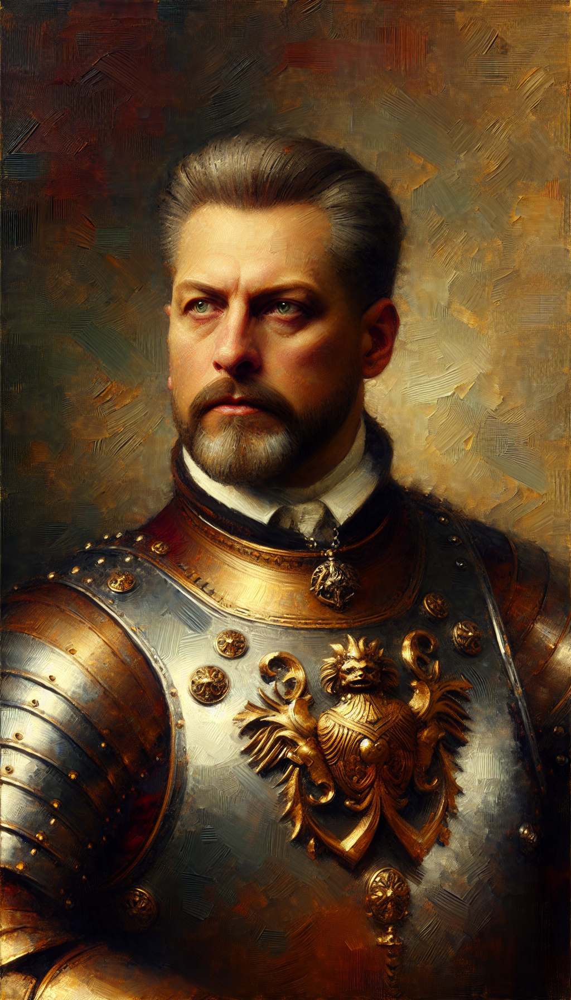

# Lord Halvar Dendros

**Type:** Human noble (or look-alike?)  
**Status:** Active - whereabouts uncertain  

## Overview

Lord Halvar Dendros is a noble figure connected to Rayne Willowshade's backstory. Rayne was arrested at his home, and before her arrest she buried a special artifact under an Oak tree on his property for safekeeping.

## Known Information

- Rayne was arrested at his home prior to her imprisonment in Vaultspire
- Someone matching his description was seen unearthing Rayne's buried artifact (witnessed by Bristle)
- A look-alike was spotted among the guards at the Ironwood Fortress soup kitchen
- Attended (or his look-alike attended) a feast at the Silver Oak in Ironwood Fortress (session 2026-04-10)

## Open Questions

- Is the person seen around Ironwood Fortress actually Dendros, or a look-alike?
- What is his connection to the guards in Ironwood Fortress?
- Does he know about Rayne's artifact? What does he want with it?
