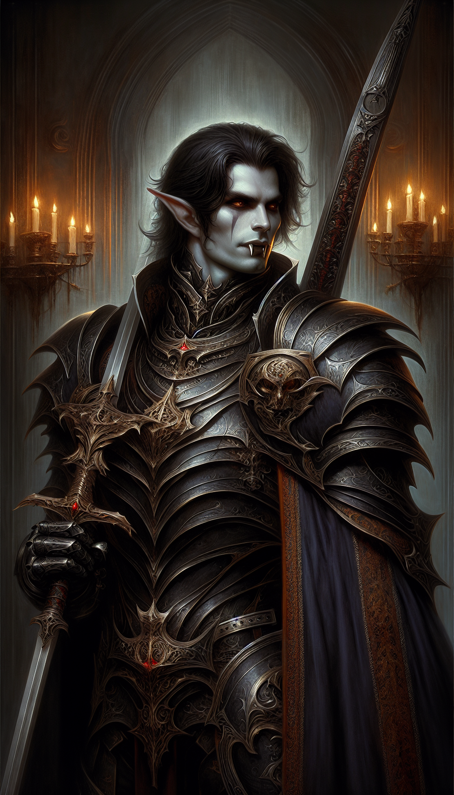

# Alarak Vaelor Veltharion

**Player:** Aricin  
**Class:** Paladin 2  
**Race:** Dhampir  
**Level:** 2  
**HP:** 18  
**Status:** Left Party

## Ability Scores

| STR | DEX | CON | INT | WIS | CHA |
|-----|-----|-----|-----|-----|-----|
| 15 (+2) | 13 (+1) | 13 (+1) | 10 (+0) | 12 (+1) | 16 (+3) |

## Spells Known

- Cure Wounds
- Divine Smite

## Feats

- Great Weapon Fighting
- Weapon Mastery
- Dark Bargain

## Inventory

- Half Plate
- Greatsword
- Chest
- Clothes, Common
- Pick, Miner's
- Crowbar
- Hammer
- Holy Water (flask)
- Manacles
- Mirror, Steel
- Oil (flask)
- Tinderbox
- Torch
- Stake (Wooden)
- Holy Symbol

*Last updated: 2026-04-10*