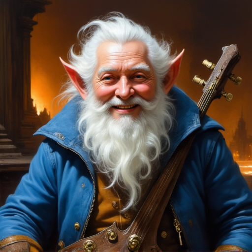

# Fib Noodlecork

**Player:** jackle1127  
**Class:** Bard 2  
**Race:** Forest Gnome  
**Level:** 2  
**HP:** 17  
**Status:** Active

## Ability Scores

| STR | DEX | CON | INT | WIS | CHA |
|-----|-----|-----|-----|-----|-----|
| 8 (-1) | 14 (+2) | 15 (+2) | 11 (+0) | 12 (+1) | 15 (+2) |

## Combat

| AC | Initiative | Speed | Proficiency |
|----|-----------|-------|-------------|
| 13 (Leather) | +4 | 25 ft. | +2 |

**Saving Throws:** STR -1 | DEX* +4 | CON +2 | INT +0 | WIS* +3 | CHA +2  
*proficient

**Skills (proficient):** Performance +6 (Expertise), Persuasion +6 (Expertise), Deception +4, Arcana +2, History +2  
**Passive Perception:** 11  
**Darkvision:** 60 ft.

## Features and Traits

### Bard Features
**Bardic Inspiration (2/day):** As a Bonus Action, choose one creature other than yourself within 60 ft. who can hear you. That creature gains one Bardic Inspiration die (d6). Once within the next 10 minutes, the creature can roll that die and add the number rolled to one ability check, attack roll, or saving throw it makes.  
**Spellcasting (CHA):** Spell Save DC 12, Spell Attack +4  
**Jack of All Trades:** Add half your proficiency bonus (+1) to any ability check that doesn't already use your proficiency bonus.  
**Expertise:** Double proficiency bonus for Performance (+6) and Persuasion (+6).

### Forest Gnome Traits
**Gnomish Cunning:** Advantage on INT, WIS, and CHA saving throws against magic.  
**Minor Illusion:** You know the Minor Illusion cantrip.  
**Speak with Animals:** You always have Speak with Animals prepared; it doesn't count against your prepared spells.  
**Gnomish Lineage:** Forest Gnome - speak with Small or smaller beasts.

### Sage Background
**Researcher:** When you attempt to learn or recall a piece of lore, if you don't know the information, you often know where and from whom you can obtain it.  
**Tool Proficiency:** Calligrapher's Supplies  
**Magic Initiate (Wizard, CHA):** Cantrips: Chill Touch, Message. Level 1 spell (1/day): Find Familiar.

## Spells

**Cantrips:** Minor Illusion, Vicious Mockery, Prestidigitation, Chill Touch, Message  
**1st Level (2 slots):** Charm Person, Healing Word, Thunderwave, Dissonant Whispers  
**Magic Initiate (1/day):** Find Familiar

## Languages

Common, Elvish, Gnomish

## Equipment

Leather Armor, 2 Daggers, Lute, Entertainer's Pack, Calligrapher's Supplies, Traveler's Clothes, 35 GP

## Backstory

Fib Noodlecork grew up in Frostguard, at the far northeastern edge of the world. It's a hard place - cold most of the year, dark half of it - and people there learn early to keep themselves entertained or go quietly mad. He picked the lute. By the time he was fifty he was good enough that the longhouses would let him eat for free in exchange for keeping the fire lively.

He spent decades traveling the ice region - Frostguard to Winter's Edge to Frosthaven and back - playing wherever they'd have him, picking up stories along the way. He got good at listening. Merchants talk when the ale is flowing, and the ale flows when someone's playing. Over the years he filled three journals with things people probably didn't intend to tell him: trade disputes, old feuds, the names of people who owed money to other people who didn't exist anymore.

He headed south not for any particular reason. Old enough to be curious, young enough to still care. He crossed through Tripoint and into the Central Heartlands and found the weather considerably more agreeable. He's been wandering ever since, playing wherever there's a warm fire and a willing audience. He heard Ironwood Fortress has a decent inn. He's been making his way there.

*Last updated: 2026-04-27*
