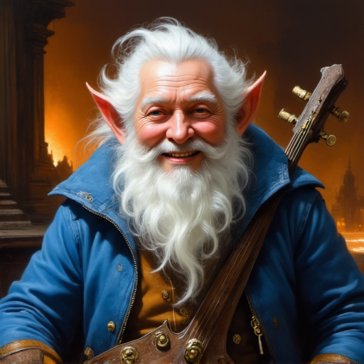

# Fib Noodlecork

**Player:** jackle1127  
**Class:** Bard 2  
**Race:** Forest Gnome  
**Level:** 2  
**HP:** 17  
**Status:** Active

## Ability Scores

| STR | DEX | CON | INT | WIS | CHA |
|-----|-----|-----|-----|-----|-----|
| 8 (-1) | 16 (+3) | 14 (+2) | 10 (+0) | 12 (+1) | 15 (+2) |

## Combat

| AC | Initiative | Speed | Proficiency |
|----|-----------|-------|-------------|
| 13 (Leather) | +5 | 25 ft. | +2 |

**Saving Throws:** STR -1 | DEX* +5 | CON +2 | INT +0 | WIS* +3 | CHA +2  
*proficient

**Skills (proficient):** Sleight of Hand +9 (Expertise), Stealth +9 (Expertise)

**Passive Perception:** 11  
**Darkvision:** 60 ft.

## Features and Traits

### Bard Features
**Bardic Inspiration (2/day):** As a Bonus Action, choose one creature other than yourself within 60 ft. who can hear you. That creature gains one Bardic Inspiration die (d6). Once within the next 10 minutes, the creature can roll that die and add the number rolled to one ability check, attack roll, or saving throw it makes.  
**Spellcasting (CHA):** Spell Save DC 12, Spell Attack +4  
**Jack of All Trades:** Add half your proficiency bonus (+1) to any ability check that doesn't already use your proficiency bonus.  
**Expertise:** Double proficiency bonus for Sleight of Hand (+9) and Stealth (+9).

### Forest Gnome Traits
**Gnomish Cunning:** Advantage on INT, WIS, and CHA saving throws against magic.  
**Minor Illusion:** You know the Minor Illusion cantrip.  
**Speak with Animals:** You always have Speak with Animals prepared; it doesn't count against your prepared spells.  
**Gnomish Lineage:** Forest Gnome - speak with Small or smaller beasts.

### Criminal Background
**Criminal Contact:** You have a reliable contact in the criminal underworld who can pass along information.  
**Tool Proficiency:** Thieves' Tools

## Spells

**Cantrips:** Minor Illusion, Vicious Mockery, Prestidigitation  
**1st Level (2 slots):** Charm Person, Healing Word, Thunderwave, Dissonant Whispers

## Languages

Common, Elvish, Gnomish

## Equipment

Leather Armor, 2 Daggers, Lute, Entertainer's Pack, Thieves' Tools, Crowbar, Traveler's Clothes, 35 GP

## Backstory

Fib Noodlecork grew up in Nocturnia, deep in the vampire kingdom's shadow. His village sat at the edge of Eboncrest, far enough from Sanguine Keep to be mostly ignored, close enough to know better than to draw attention. He learned early that a cheerful gnome with a lute was invisible - vampires don't care about the entertainment, they care about the blood - and invisible meant safe. He played the courts, the shadow taverns, the feeding halls where nobles negotiated over goblets of things he tried not to think about. People talked. He listened. He got very good at both.

He spent decades brokering information across Nocturnia, surviving not through strength but through being the least threatening creature in every room. When he finally slipped out south through the forest toward the Central Heartlands, he brought his lute, his tools, and a head full of secrets about the Council of 12 that he has never once told anyone.

He was making a comfortable living in the heartlands when a document came through his network - something linking a noble house to the Argent Circle - and he held onto it one day too long. The Argent Circle had him arrested and sent to Vaultspire, apparently deciding that was more insulting than a clean death.

He did his time in the Black Pits quietly, mapping guard rotations out of old habit. When the chaos of a breakout swept through the prison, Fib walked out the front gate in a stolen guard's uniform, lute under one arm, whistling.

He's been making his way toward Ironwood Fortress ever since. He still has a copy of that document.

*Last updated: 2026-04-27*
