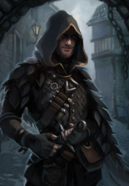

# Vacir

**Player:** Phxent23  
**Class:** Rogue 2  
**Race:** Variant Human  
**Level:** 2  
**HP:** 17  
**Status:** Active

## Ability Scores

| STR | DEX | CON | INT | WIS | CHA |
|-----|-----|-----|-----|-----|-----|
| 10 (+0) | 15 (+2) | 14 (+2) | 14 (+2) | 12 (+1) | 10 (+0) |

## Combat

| AC | Initiative | Speed | Proficiency |
|----|-----------|-------|-------------|
| 12 (Unarmored) | +2 | 30 ft. | +2 |

**Saving Throws:** STR +0 | DEX* +4 | CON +2 | INT* +4 | WIS +1 | CHA +0  
*proficient

**Skills (proficient):** Acrobatics +4, Athletics +2, Investigation +4, Perception +3, Stealth +4

**Passive Perception:** 13

## Features and Traits

### Rogue Features
**Expertise:** You gain Expertise in two of your skill proficiencies of your choice. At Rogue level 6, you gain Expertise in two more of your skill proficiencies of your choice.
**Sneak Attack:** You know how to strike subtly and exploit a foe's distraction. Once per turn, you can deal an extra 1d6 damage to one creature you hit with an attack roll if you have Advantage on the roll and the attack uses a Finesse or a Ranged weapon. The extra damage's type is the same as the weapon's type. You don't need Advantage on the attack roll if at...
**Thieves’ Cant:** You picked up various languages in the communities where you plied your roguish talents. You know Thieves' Cant and one other language of your choice.
**Weapon Mastery:** Your training with weapons allows you to use the mastery properties of two kinds of weapons of your choice with which you have proficiency, such as Daggers and Shortbows. Whenever you finish a Long Rest, you can change the kinds of weapons you chose. For example, you could switch to using the mastery properties of Scimitars and Shortswords.
**Cunning Action:** Your quick thinking and agility allow you to move and act quickly. On your turn, you can take one of the following actions as a Bonus Action: Dash, Disengage, or Hide.

### Variant Human Traits
**Skills:** You gain proficiency in one skill of your choice.
**Feat:** You gain one feat of your choice.

### Feats
**Alert:** Origin Feat You gain the following benefits. Initiative Proficiency. When you roll Initiative, you can add your Proficiency Bonus to the roll. Initiative Swap. Immediately after you roll Initiative, you can swap your Initiative with the Initiative of one willing ally in the same combat. You can't make this swap if you or the ally has the...
**Weapon Mastery:** Your training with weapons allows you to use the mastery properties of two kinds of weapons of your choice with which you have proficiency. Whenever you finish a Long Rest, you can change the kinds of weapons you chose.
**Dark Bargain:** At your GM's discretion, you can take a Dark Bargain.

*Last updated: 2026-04-24*
