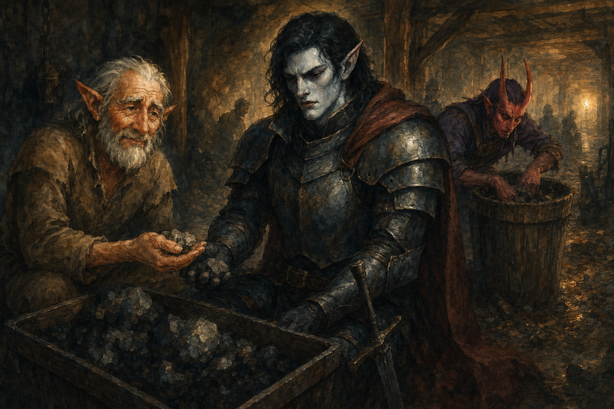

# 2026-01-30 - Prong Gathering and Lockpick Attempt

- Vacir obtained the first fork prong
- Slick crafted a full lockpicking kit that was immediately lost
- Grimshaw (old half-elf) gave his mining quota to Alarak so that Alarak could eat
- Vacir started befriending the lunch lady Helga
- Szeth crafted 5 prongs the next day, then went trash can diving for the lost lockpicking kit - lost a few prongs in the process, 2 remaining
- Alarak created a great distraction but couldn't hold his tongue with a guard and forfeited his meal 2 days in a row; Szeth brought him leftover bricked beans
- Vacir attempted to lockpick his way out of his cell - unsuccessful, broke a prong
