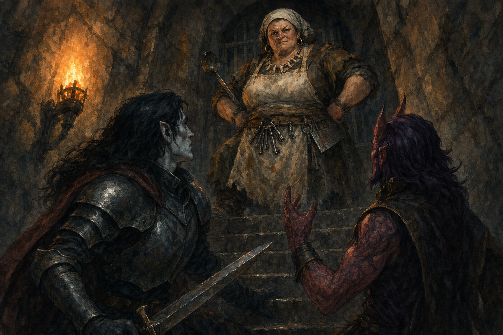

# 2026-02-13 - Escape Attempt, Meets Helga

- Rayne joined the team
- Everyone met their quota and crafted 3 more prongs, bringing the total to 5
- Team devised a plan: escape cells during the night and hide in the weekly supply crates delivered to the mess hall
- Vacir, Slick, and Rayne successfully picked their locks and snuck past the dozing guard
- Team split up: Slick and Rayne gave their prongs to Vacir and headed to the mess hall entrance; Vacir went up to floor 50 to find Szeth and Alarak
- Szeth and Alarak had failed to break out of their cells; Vacir picked their locks and freed them
- On the way back down past the mess hall, one prong was used as a distraction so Vacir, Alarak, and Szeth could slip past the guard quarters - 1 prong remaining
- Slick and Rayne fell over for the third time in a row trying to enter an access vent in front of the mess hall; a mysterious figure began approaching from the upper floor
- Vacir, Alarak, and Szeth spotted the figure on their descent and prepared for an attack - Vacir recognized her as Helga, the lunch lady
