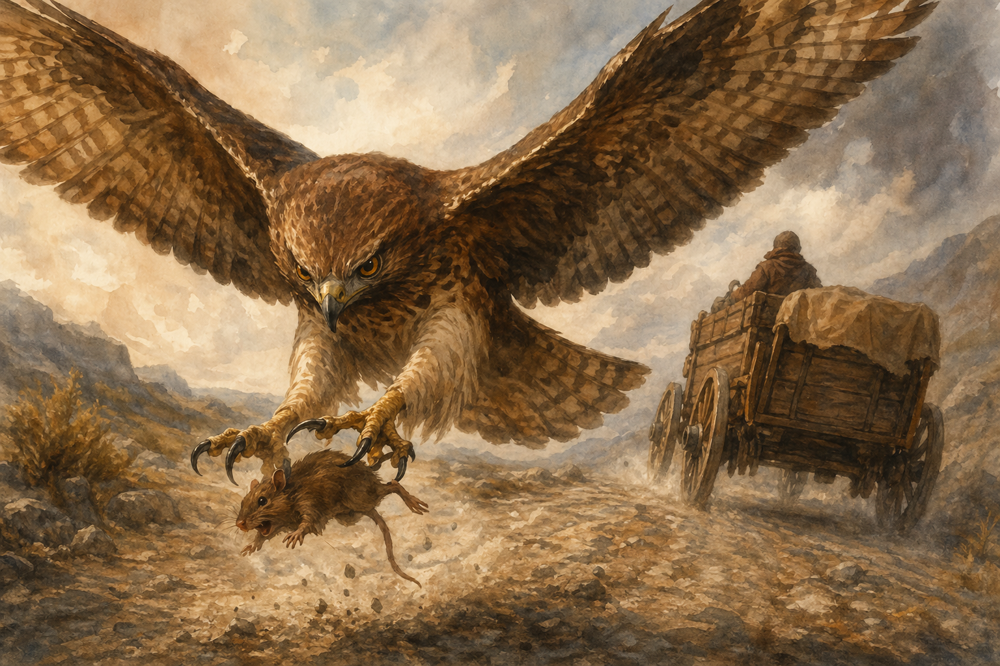

# 2026-02-27 - Escape from Vaultspire

- Helga retrieved her savings (for her sick mother) and decided to escape with the group - she was out of PTO
- Made a deal with Helga: deliver items to her family in exchange for her silence and help
- Helga unlocked the mess hall doors; guards were inside - Helga opened the door and the party peeked in
- Vacir tripped and made noise; Helga threw something on his face to cover it
- Vacir made a guard suspicious; Helga threw flour in the guard's eyes to cover the group
- Vacir, Alarak, and Szeth returned to the mess hall disguised as cafeteria workers preparing slosh, recovered Helga
- Vacir watched the door to see what happened to Helga
- Everyone including Helga and her savings (a heavy chest) were hidden inside storage crates bound for Ironwood Fortress (the prison's food origin)
- Carriage left Vaultspire - party leveled up to level 2
- Rayne wildshped into a rat and scouted the carriage; on her return, rough terrain knocked her off the carriage
- Slick summoned Beef the hawk to catch the falling rat mid-air
- Beef eyed Rayne wanting to eat her - she shifted back to human form
