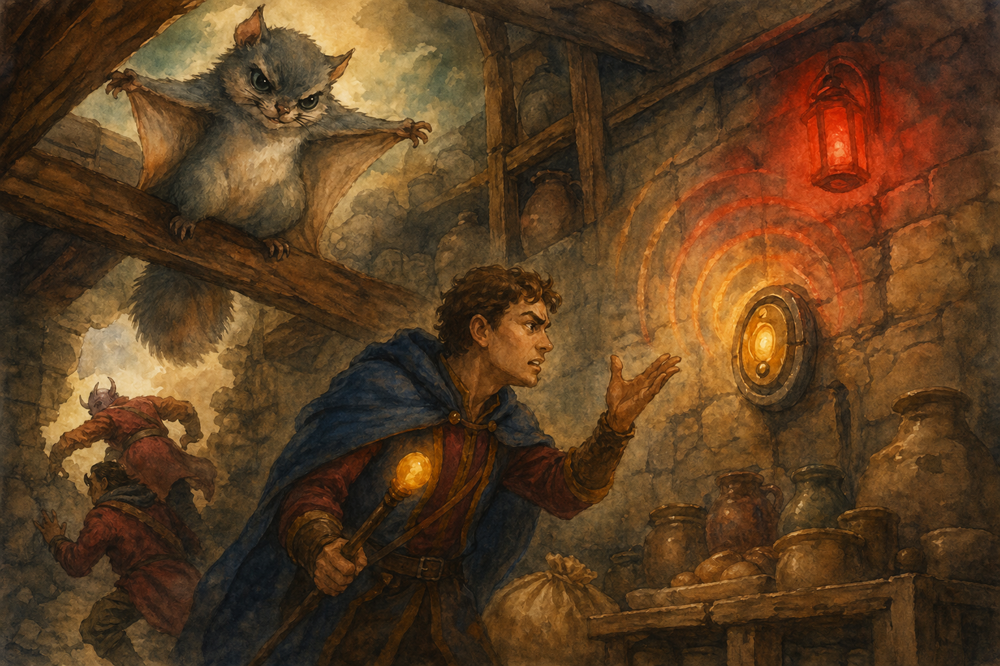

# 2026-03-13 - Ironwood Fortress Soup Kitchen

- Party stayed hidden in their crates until reaching the city gates of Ironwood Fortress
- Beef the hawk hid in Slick's crate; when a guard smashed a crate to check its contents, Beef dug his talons into Slick out of fear
- Party arrived at their final destination: a soup kitchen's storage room
- Met Bristle, a sassy flying squirrel with a peculiar drawing attached to his leg (a short stout man in shiny armor)
- Rayne followed her old companion Bristle up into the rafters
- Slick attempted to solve a voice-activated lock mechanism; failed once, forgot to remove his hand, argued with the mechanism, and tripped the alarm
- Szeth blasted the mechanism to smithereens
- Rayne, Vacir, and Alarak safely escaped through the 3'x3' hole Bristle indicated
- Szeth, Slick, and Helga were spotted by a pair of guards - brief duel ensued
- A wooden beam snapped under the pressure of Helga's dash, ending the fight
- Szeth barely held on to the edge of the hole; Slick and Helga did the same
- Helga toppled onto Vacir and they had their first (accidental) kiss
- Party reunited in the new room; Bristle gave them a few frustrated squeaks about their performance
