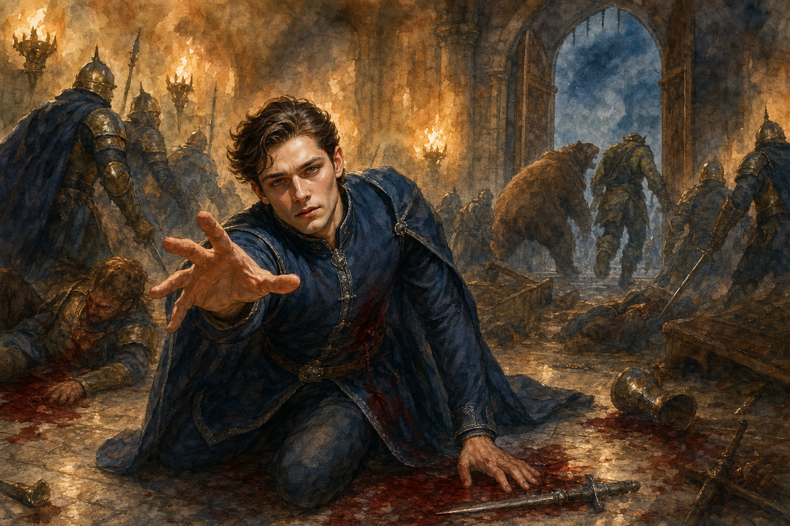

# 2026-04-24 - Darian Dies at Silver Oak

- Bristle came and pulled the party back to camp
- Alarak was missing - the party could not find him
- Found a letter from Alarak saying he is returning Helga's chest to her family
- The party hopes to meet him again under better circumstances
- **Alarak has left the group**
- Party is heading to the Silver Oak feast in Darian's Thornecrest carriage - a fancy carriage bearing the Thornecrest family crest
- Met Briggs, a big orc security guard at the gate of the Silver Oak, played by Kyle (Aricin, Alarak's player)
- Darian mistook Briggs for a valet; Szeth paid him 5gp to park the carriage and avoid making a scene
- Briggs parked the carriage; the whole party got past the gate, then split: Vacir, Rayne, and Bristle broke off to search for Rayne's artifact; Darian and Szeth got inside the Silver Oak building for the feast
- Rayne wildshaped into a rat to break into the building; Vacir is also sneaking in
- A group of drunk, rowdy gnomes arrived and tried to get past Briggs for free food
- Vacir tried the door; Bristle wanted him to try the window instead
- Bristle and Rayne (as a rat) climbed up to the window and unlocked it from the outside
- Vacir, Rayne, and Bristle all slipped into the room through the window
- The group made general observations of the Silver Oak interior
- The Lord Halvard Dendros look-alike took the podium and gave a speech naming 5 wanted rebels - Slick was marked with a big red X (deceased)
- Darian stepped forward and approached the stage to confront the speaker for dishonoring his brother's name
- After being ignored, Szeth tried to pull Darian back to their table
- Darian, frustrated, pointed out Szeth as the man on the wanted poster
- Guards realized some or all of the criminals were present and took up arms
- **Combat broke out**: Briggs set a fire to distract the guards; Vacir fought; Bristle and Rayne held off Dendros
- Szeth and Darian found themselves badly out of their depth in close-quarters melee and went down
- Briggs dragged the unconscious Szeth out to the chariot
- Bear Rayne grabbed Vacir in her mouth and dashed to the chariot
- Rayne healed the unconscious Szeth and Vacir; Briggs drove the chariot rolling
- **Darian was killed** - fell in the battle at the Silver Oak, the last Thornecrest brother
